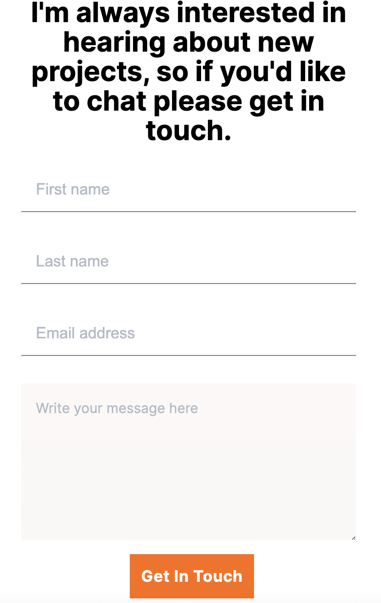

# Software developer portfolio website - Contact form

* Add Contact form.
* Use Figmna tamplate for styling.
* Collect data by using the Formspree service.
* Don't need to implement any functionality that requires JavaScript.

## Live version
You can visit live version via [link](https://elmar8287.github.io/contact-form/)

## Built With

- HTML/CSS/JS
- Figma
- GH pages

## Author

👤 **Elmar Abdulkarimov**

- GitHub: [@elmar8287](https://github.com/elmar8287)

## 🤝 Contributing

Contributions, issues, and feature requests are welcome!

Feel free to check the [issues page](../../issues/).